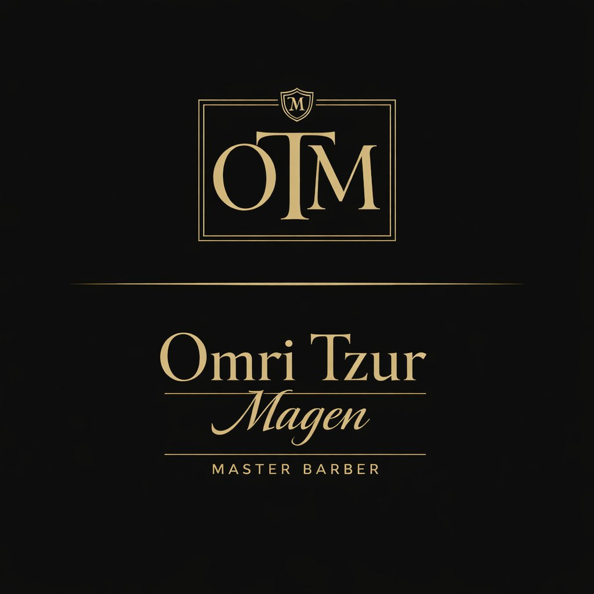

<div align="center">



# ✂️ עומרי צור מגן — Master Barber

### אתר תדמית יוקרתי · Classic Barbershop Website

*תספורות גברים ברמת דיוק גבוהה · עיצוב זקן קלאסי · טיפוח שמדבר סטייל*

<br/>


</div>

---

## 📖 אודות הפרויקט

אתר תדמית **פרודקשן-רדי** עבור עומרי צור מגן — ספר מאסטר-בארבר.
האתר נבנה ב-**Vanilla HTML / CSS / JavaScript** ללא כל תלות חיצונית (אין React, אין build step, אין npm) — פשוט לפתוח ולהפעיל.

### 🎨 קונספט עיצובי

| אלמנט | פרטים |
|---|---|
| **סגנון** | Old Money Barber — קלאסי, יוקרתי, ללא קליפי "AI" |
| **פלטה** | שחור עמוק (`#0a0807`) · קרם (`#f4ede1`) · זהב עתיק (`#b08d4a`) |
| **טיפוגרפיה** | Frank Ruhl Libre · Heebo · Cormorant Garamond |
| **שפה** | עברית מלאה · כיווניות RTL |
| **מוביל עיצובי** | וידאו ברקע · לוגו זוהר · dropdown תפריט · lightbox לגלריה |

<br/>

## ✨ תכונות עיקריות

- 🎬 **Hero עם וידאו ברקע** — גילוח סכין בסלואו מושן, עם עיבוד דרמטי
- 🎯 **FOMO חי** — "התורים נתפסים מהר" עם נקודה אדומה פועמת
- 📱 **Mobile-first Responsive** — 3 breakpoints (960 / 640 / 380)
- 🖼️ **Lightbox Gallery** — ניווט מקלדת, swipe, ESC, RTL-friendly
- 📞 **CTA אגרסיבי** — WhatsApp עם הודעה מוכנה + טלפון ישיר
- 🌙 **PWA** — ניתן להתקנה כאפליקציה, עובד offline
- 🔒 **Security Hardened** — CSP, HSTS, no `innerHTML`, no `eval`
- 🔍 **SEO Optimized** — Schema.org, Open Graph, Meta tags, Sitemap
- ♿ **Accessible** — ARIA labels, semantic HTML, prefers-reduced-motion
- ⚡ **Fast** — 0 dependencies, < 500KB total, lazy loading

<br/>

## 📁 מבנה הפרויקט

```
omri-tzur-magen/
│
├── 📄 index.html               # הדף הראשי (HTML5, RTL, עברית)
├── 🎨 style.css                # כל הסגנונות (mobile-first)
├── ⚙️  script.js                # לוגיקה (תפריט, לייטבוקס, PWA)
│
├── 📱 manifest.json            # PWA manifest
├── 🔧 sw.js                    # Service Worker (offline cache)
│
├── 🔒 _headers                 # HTTP Security Headers (Netlify/CF)
├── 🤖 robots.txt               # הנחיות לזחלנים
├── 🗺️  sitemap.xml              # מפת אתר ל-SEO
│
├── 📂 assets/
│   ├── logo.png                # לוגו מלא (רקע שחור, ל-OG)
│   ├── logo-full.png           # לוגו שקוף (ל-Hero)
│   ├── mark-otm.png            # מונוגרם OTM (ל-Header)
│   ├── wordmark.png            # Wordmark (ל-Footer)
│   ├── favicon.png             # אייקון דפדפן
│   ├── apple-touch-icon.png    # אייקון iOS
│   ├── omri-portrait.jpg       # פורטרט של עומרי
│   ├── video.mp4               # וידאו ל-Hero (גילוח)
│   └── [gallery-images].jpg    # 6 תמונות לגלריה
│
└── 📖 README.md                # אתה פה
```

<br/>

## 🚀 איך להריץ לוקלית

```bash
# פשוט הפעל שרת סטטי - אין build step
python3 -m http.server 8000
# פתח בדפדפן: http://localhost:8000
```

> ⚠️ **שים לב:** ה-PWA וה-Service Worker דורשים `http://` — לא יעבדו עם `file://`.

<br/>

## 🌐 העלאה לאוויר (Deploy)

### 🏆 מומלץ: Cloudflare Pages / Netlify (חינם + אבטחה מלאה)

הפלטפורמות האלה **תומכות בקובץ `_headers`** → מקבלים HSTS, X-Frame-Options, COOP, CORP אמיתיים בצד-שרת.

```bash
git init
git add .
git commit -m "Initial commit"
git branch -M main
git remote add origin https://github.com/USER/omri-tzur-magen.git
git push -u origin main
```

ואז ב-[Cloudflare Pages](https://pages.cloudflare.com/) או [Netlify](https://netlify.com):
1. Connect GitHub Repository
2. Build command: *(השאר ריק)*
3. Output directory: *(השאר ריק או `/`)*
4. Deploy → ✅ האתר באוויר

### 📋 GitHub Pages (חינם, אבל מוגבל)

```bash
# אחרי push ל-GitHub:
Settings → Pages → Source: main / root → Save
```

> ⚠️ **GitHub Pages מתעלם מקובץ `_headers`.** תקבל את ה-CSP דרך meta tags בלבד, בלי HSTS ו-X-Frame-Options. מבחינת ביצועים ו-CDN — מצוין. מבחינת אבטחה-מקסימלית — עדיף Cloudflare Pages.

<br/>

## 🔒 אבטחה

### ✅ מה קיים בקוד

| הגנה | סוג | תיאור |
|---|---|---|
| **Content-Security-Policy** | Meta tag | חוסם inline scripts, מגביל לפונטים של Google בלבד |
| **X-Content-Type-Options** | Meta tag | `nosniff` — מונע MIME-sniffing |
| **Referrer-Policy** | Meta tag | `strict-origin-when-cross-origin` |
| **Permissions-Policy** | Meta tag | מבטל geolocation, camera, mic, payment, FLoC |
| **No `innerHTML`** | JS code | כל עדכוני DOM עם `textContent` / `appendChild` |
| **No `eval` / no inline events** | JS code | עמידה מלאה ב-CSP `script-src 'self'` |
| **rel="noopener noreferrer"** | HTML | על כל קישור `target="_blank"` |

### ✅ מה מוסיף קובץ `_headers` (Netlify / CF Pages)

- **HSTS** — `max-age=63072000; includeSubDomains; preload`
- **X-Frame-Options: DENY** — הגנה מ-clickjacking
- **Cross-Origin-Opener-Policy** — הגנה מ-Spectre-style attacks
- **Cross-Origin-Resource-Policy** — מונע שימוש ב-resources מדומיינים אחרים

<br/>

## 📱 PWA — התקנה כאפליקציה

האתר ניתן להתקנה כאפליקציית Native בנייד:

- 📲 **iOS**: Safari → Share → "Add to Home Screen"
- 🤖 **Android**: Chrome → ⋮ → "Install app"

**Service Worker** מטמין את כל הנכסים → האתר עובד **גם בלי אינטרנט**.

<br/>

## 🎯 SEO

- ✅ **Schema.org HairSalon** — rich snippets ב-Google
- ✅ **Open Graph** — תצוגה יפה בשיתוף ברשתות החברתיות
- ✅ **Meta description + title** באורך אופטימלי
- ✅ **Semantic HTML5** — `<section>`, `<article>`, `<nav>`, `<header>`, `<footer>`
- ✅ **Sitemap.xml + robots.txt**
- ✅ **Lazy loading** על תמונות
- ✅ **alt text** על כל תמונה

<br/>

## ✏️ מה צריך להתאים לפני העלאה

- [ ] 🎥 להוסיף את `assets/video.mp4` (וידאו של גילוח, 1920×1080, ~7MB)
- [ ] 🖼️ להוסיף 6 תמונות גלריה ל-`assets/`:
    - `classic-fade.jpg`
    - `cutting-man.jpg`
    - `beard-shaping.jpg`
    - `side-picture.jpg`
    - `wax-pic.jpg`
    - `beard.jpg`
- [ ] 📍 להחליף "בקרוב" בכתובת אמיתית כשיש מיקום
- [ ] 🔗 להחליף קישורי Instagram / Facebook / TikTok (כרגע `href="#"`)

<br/>

## 🔮 שדרוגים עתידיים (נשמרו בהערות בקוד)

- [ ] 🗺️ **Google Maps Embed** — כשתהיה כתובת
- [ ] 📅 **Booksy / Setmore** — מערכת הזמנת תורים
- [ ] 💬 **כפתור WhatsApp צף** — תמיד נגיש בפינת המסך
- [ ] 📌 **Sticky CTA Bar** — במובייל
- [ ] 🔤 **Self-hosted Google Fonts** — פרטיות + מהירות
- [ ] 🏢 **Schema.org Address + Geo** — Google Map Pack
- [ ] 🖼️ **Before/After Slider** — מגדיל אמון דרמטית

<br/>

## 🎨 התאמה אישית

### שינוי צבעים

ערוך את משתני ה-CSS ב-`style.css`:

```css
:root {
  --ink: #0a0807;        /* שחור ראשי */
  --cream: #f4ede1;      /* קרם - רקע בהיר */
  --gold: #b08d4a;       /* זהב עתיק - אקסנט */
  --gold-soft: #c9a866;  /* זהב בהיר יותר */
}
```

### החלפת תמונה בגלריה

```html
<figure class="g-item g-1" data-caption="תיאור התמונה">
  
</figure>
```

Lightbox יטפל אוטומטית בתמונה החדשה — אין צורך לשנות JavaScript.

<br/>

## 🌐 דפדפנים נתמכים

| דפדפן | גרסה |
|---|---|
| Chrome | 90+ |
| Safari | 14+ |
| Firefox | 88+ |
| Edge | 90+ |

<br/>

## 📞 יצירת קשר עם הספר

<div align="center">

**📱 טלפון:** [052-545-3732](tel:+972525453732)

**💬 WhatsApp:** [לחצו לקביעת תור](https://wa.me/972525453732)

</div>

<br/>

## 📜 רישיון

**Private** — כל הזכויות שמורות לעומרי צור מגן.
הקוד שייך לעומרי בלעדית ואינו ברשיון פתוח.

<br/>

---

<div align="center">

### ✂️ *נבנה בדיוק כמו העבודה שלנו — מדויק עד הפרטים הקטנים.* ✂️

<sub>Built with precision · Zero dependencies · Production-ready</sub>

</div>
